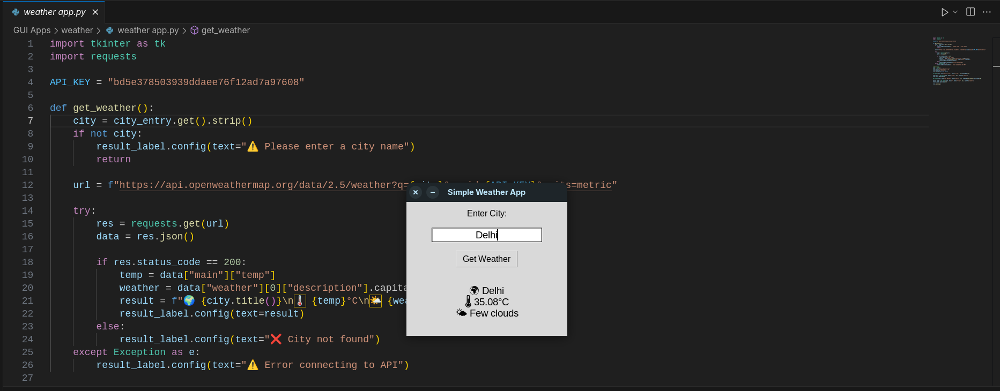

# Python Weather App (Tkinter GUI)

A lightweight desktop weather app built with Python and Tkinter.
It fetches real-time weather data using the OpenWeatherMap API.

# Features

- 🌍 Get weather by city name
- 🌡️ Shows temperature in Celsius
- 🌦️ Weather condition with emoji
- 🐍 Built with `tkinter`, `requests`

# Requirements

- Python 3.x
- Libraries:
  - `requests`
  - `tkinter` (comes with Python)

Install requests if needed:
`` bash(terminal)
pip install requests

# Screenshot

